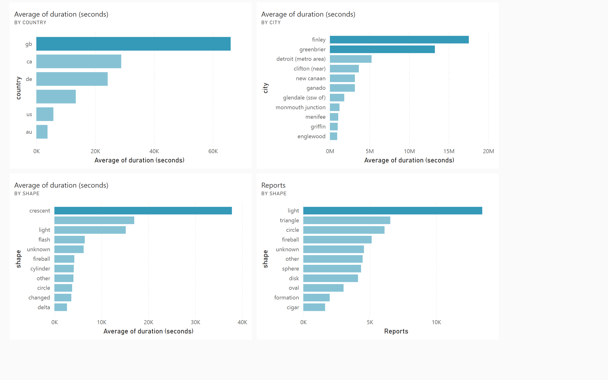

🛸 UFO Sightings Analysis Dashboard
This project is a data analysis and visualization of 9,670 UFO sighting reports sourced from Kaggle. The analysis explores temporal trends, geographical distribution, and sighting characteristics to uncover fascinating insights about global UFO sightings.

📊 Dashboard Overview 
link: https://app.powerbi.com/reportEmbed?reportId=e41ad366-79fd-4084-89cc-4ae5ed624339&autoAuth=true&ctid=63c3c9c1-e824-413f-b435-2f0cabb2828f
1️⃣ Key Metrics
Total Reports: 96,700+

Time Span: 1900 – 2014

Data Points: 80K+

2️⃣ Visualizations
Sightings Trends
Sightings by Year: Shows a sharp increase in sightings after 1990, peaking in the early 2000s.

Reports by Year: Highlights fluctuations in reporting activity over time.

Duration & Shape Analysis
Duration by Year and Country: UFO sightings in the USA dominate in total sighting duration.

Average Duration by Shape: "Cone" and "Sphere" shapes have the longest average duration, while "Flash" and "Circle" are brief.

Seasonality & Monthly Trends
Sightings by Quarter and Month: Sightings peak during summer months (July–August), suggesting seasonality.

Geographic Distribution
Global Sightings Map: Most sightings are concentrated in the USA, with additional clusters in the UK, Canada, and Australia.

Shapes by Reports: "Light" and "Triangle" are the most reported UFO shapes.

[Download Full Dashboard PDF](ufo.pdf)

🔑 Key Insights
Sightings Growth: UFO sightings surged after the 1980s, peaked in the 1990s, and declined in the 2010s—possibly due to public disinterest or better scientific explanations.

Geographic Distribution:

USA dominates with 65K+ reports, followed by Canada at only 3K reports.

Zero reports from Russia, Greenland, and several regions in Africa, the Middle East, and Asia.

Sightings decrease as we move eastward and northward.

Sighting Types:

Light-like sightings are the most common (16K+ reports).

Followed by triangle and circle shapes (~7K each).

Seasonality:

Peak sightings occur in summer, while winter (Feb–Apr) sees the fewest.

Flash, cone, light, and fireball are most common in peak months.

Longest Recorded Sightings:

In 1993, sphere-shaped sightings lasted 97M+ seconds (across only 4 sightings).

Interestingly, the longest sightings were not in the U.S. but in Great Britain (Finley & Greenbrier).

Average Duration: Crescent-shaped UFOs are observed for the longest average time.

